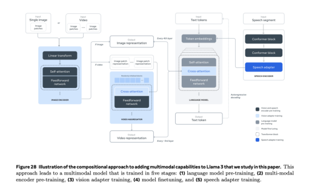
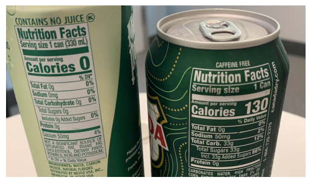

The **Llama 3.2** collection includes two large models, **11B** and **90B**, which are specifically designed for image reasoning tasks. These models can:

- Understand and interpret documents with charts and graphs
- Generate captions for images
- Perform visual grounding, allowing users to ask questions about data visualizations or maps and receive accurate responses based on visual content.

They bridge the gap between vision and language by extracting information from images and generating descriptive text.

## Lightweight Models

In contrast, the smaller **1B** and **3B** models excel in multilingual text generation and tool-calling, enabling developers to create personalized applications that run on-device, ensuring strong privacy since user data remains local. These models can perform tasks like:

- Summarizing messages
- Sending calendar invites quickly and privately.

Both sets of models offer significant benefits when run locally:

- **Instant processing times**
- **Enhanced privacy** since data does not need to be sent to the cloud.

## Model Evaluations

The evaluation results indicate that the **Llama 3.2** models are competitive with other leading models in image recognition and various visual understanding tasks, outperforming some smaller models in specific applications.

## Vision Models

The **11B** and **90B** models are the first in the Llama series to support vision tasks, requiring a new architecture that combines image and text processing. This was achieved through training with image-text pairs, allowing the models to reason about both inputs effectively.

## Lightweight Models Development

The lightweight **1B** and **3B** models were developed using pruning and knowledge distillation techniques to maintain high performance while being more efficient for on-device deployment. They also support a context length of **128K tokens** and underwent extensive fine-tuning to optimize their capabilities.

## Llama Stack API

To facilitate development, the **Llama Stack API** has been introduced, providing a standardized interface for model customization and integration. Various distributions of the **Llama Stack** are now available for different environments, including:

- On-device
- Cloud
- On-prem solutions.

## System Level Safety

In terms of safety, new safeguards have been implemented, including **Llama Guard 3**, which filters inputs and outputs for image understanding tasks. The **1B** model's deployment size has been significantly reduced, enhancing efficiency for on-device applications.

## Let's Dive into Proof of Concept

Below is the techstack used for this proof of concept.

- GCP Llama3.2 API
- Chainlit UI framework
- Docker
- Poetry
- Artifact Registry
- Cloud Run
- Cloud Build
- Cloud Storage

### Vision Tools

Vision tools, i.e., Car Damage Estimation, Code Generation, Diet Suggestion, and Know Your Fridge, are demonstrated in this proof of concept. The following images are used for the demonstration.

    

        <a href="../static/imgs/car damage.jpg">
            
            
Car Damage Estimation

        </a>
    

    

        <a href="../static/imgs/llama32mm.png">
            
            
Code Generation

        </a>
    

    

        <a href="../static/imgs/drinks.png">
            
            
Diet Suggestion

        </a>
    

## The following videos demonstrate the vision tools in action.

    <iframe src="https://drive.google.com/file/d/12pqsITsZrZjSI2iM0Y2hGO6Vth7bR-my/preview" width="300" height="300" allow="autoplay"></iframe>

    <iframe src="https://drive.google.com/file/d/1ZfXQssOkgdOwWKe15QNU6BW9qCXyk0m1/preview" width="300" height="300" allow="autoplay"></iframe>

Code is avilable [here](https://github.com/nani1149/llama3.2-gcp)

This is prepared based on DeepLearning.AI's course on [Large Language Models with Meta's Llama 3.2](https://learn.deeplearning.ai/courses/introducing-multimodal-llama-3-2/).

